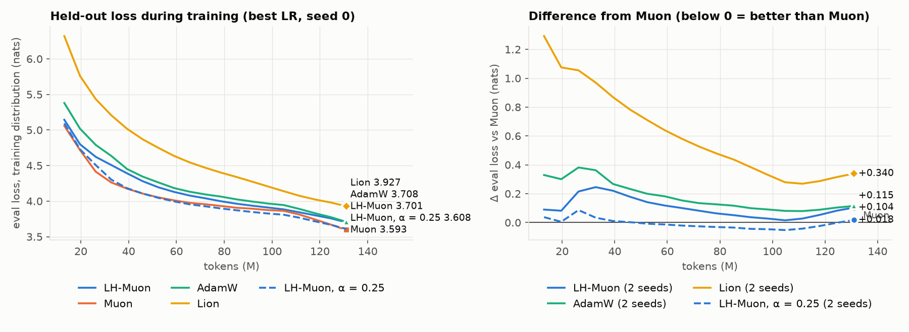
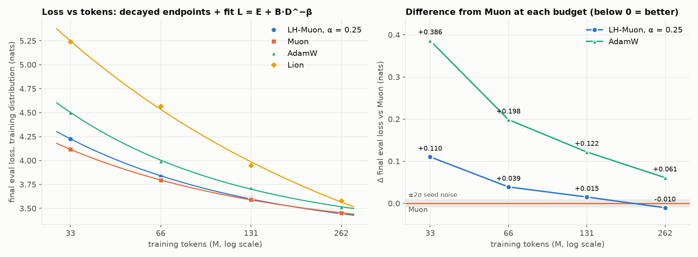
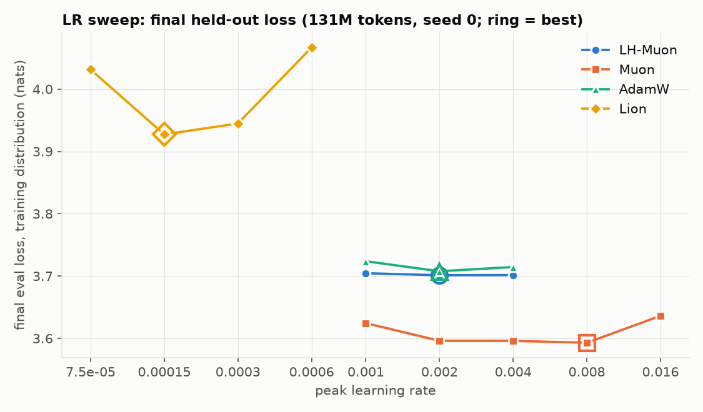
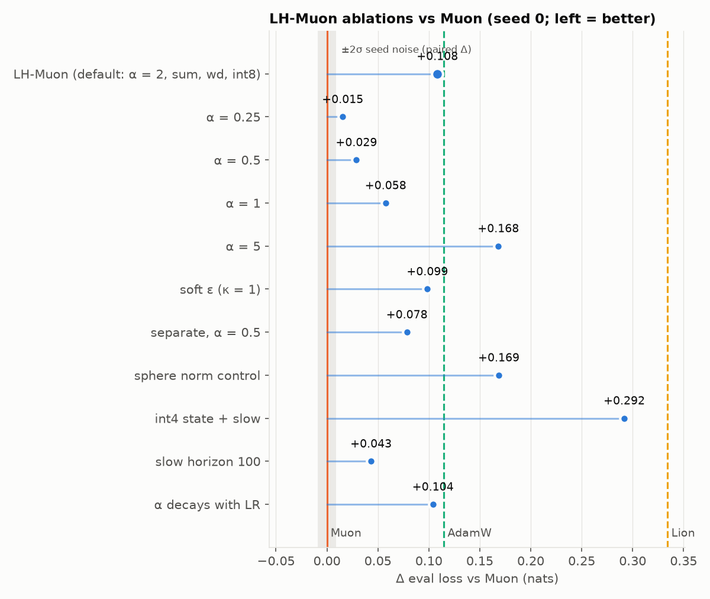

# LH-Muon

**Muon with a long-horizon slow momentum.** It adds an AdEMAMix-style slow EMA to the direction
Muon orthogonalizes, with an optional noise-floored polar map and optional norm control. It is
packaged with a memory-lean state container (block-scaled int8/int4 optimizer state, CPU
offload) and fp16-safe updates. It is a drop-in `torch.optim.Optimizer`, and it also includes
AdamW, Lion and factored-Adam update rules, so every baseline runs through the same code path.

> **Result: worse than Muon on short runs, better on the longest runs tested.** On a
> 47M-parameter GPT at 131M tokens, every slow-momentum setting loses to plain Muon. The best
> variant (α = 0.25) is **+0.017 ± 0.002 nats** worse, paired over 3 seeds, against a noise level
> of ≈ 0.005. But its deficit shrinks steadily with training length and then reverses:
> +0.110 → +0.039 → +0.015 → −0.010 → **−0.028** at 33M → 66M → 131M → 262M → 524M tokens
> (0.7–11 tokens/param). At 524M that is roughly **1.3× fewer tokens than Muon for the same loss**.
> The long-budget points are single-seed and one model size, and no further seeds were run, so this
> is a promising lead, not an established result (see [Limits](#limits-of-this-evidence)). LH-Muon costs about +1 byte/parameter of optimizer memory and ≈ 0.5% of
> training time over Muon. Full numbers are [below](#results).

## Contents

```
lhmuon/
  optimizer.py   LHMuon: spectral (LH-Muon / Muon), factored Adam, AdamW and Lion update rules
  polar.py       Newton–Schulz polar factor; soft_polar = C (CᵀC + ε²I)^(-1/2) via augmented NS
  quant.py       block-scaled state container (fp32/bf16/fp16/int8/int4/int4b16/nf4) + stochastic rounding
  routing.py     which parameter gets which rule; build_param_groups()
examples/train_lm.py        small GPT on tokenized uint16 shards; adamw / lion / muon / lhmuon arms
scripts/run_suite.py        the benchmark: LR sweep → ablations → seeds → loss-vs-tokens frontier
scripts/analyze_suite.py    tables + figures from a suite directory
scripts/fit_multiplier.py   token multiplier from fully decayed endpoints (L = E + B·D^−β fit)
scripts/bench_optimizers.py optimizer memory + step time for AdamW, Lion, Muon, LH-Muon
tests/test_lhmuon.py        50 unit tests
results/suite/              the published run: report, figures, per-run logs and final evals
```

## Results

**Setup.**
- **Model:** a 47.2M-parameter GPT: d_model 512, 8 layers, 8 heads, SwiGLU FFN with width 1408,
  RMSNorm, QK-norm, RoPE, tied embeddings, 42k vocabulary.
- **Training:** fp16 weights with stochastically rounded updates, sequence length 1024, 65,536
  tokens per step, WSD schedule (warmup 200 steps, constant, linear decay over the last 20%),
  gradient clipping at 1.0.
- **Data:** Dolma subsets `cc_en_head, c4, books, arxiv`.
- **Metric:** final loss on 512 held-out 1024-token windows from the training distribution.
- **Fairness controls:**
  - All four optimizers run through the same code path: fp32 update math, loss scaling,
    stochastic rounding and clipping are identical.
  - A given seed fixes both the initialization and the data order, so differences are compared
    **paired by seed**.
  - Every number is a fully decayed endpoint.
- **Hardware:** V100s.

The benchmark ran in four stages (`scripts/run_suite.py`): an LR sweep, LH-Muon ablations, 3 seeds
per optimizer at its best setting, and a loss-vs-tokens frontier, plus a 524M-token extension for
Muon and LH-Muon. That is 53 runs in total; every
run's log and final eval are in [`results/suite/runs`](results/suite/runs), and the generated report
is [`results/suite/report/report.md`](results/suite/report/report.md).

### Headline: best setting per optimizer, 131M tokens (2.8 tokens/param), 3 seeds

| optimizer | peak LR | loss (mean ± sd) | Δ vs Muon (paired) | Δ vs AdamW (paired) | tokens vs Muon for same loss |
|---|---|---|---|---|---|
| **Muon** | 8e-3 | **3.592 ± 0.001** | – | −0.114 ± 0.000 | 1× |
| LH-Muon, α = 0.25 | 2e-3 | 3.609 ± 0.002 | +0.017 ± 0.002 | −0.097 ± 0.002 | 0.92× |
| LH-Muon, α = 2 (default) | 2e-3 | 3.698 ± 0.007 | +0.106 ± 0.003 | −0.008 ± 0.004 | 0.67× |
| AdamW | 2e-3 | 3.707 ± 0.001 | +0.114 ± 0.000 | – | 0.66× |
| Lion | 1.5e-4 | 3.928 ± 0.007 | +0.336 ± 0.005 | +0.221 ± 0.005 | 0.36× |

The last column is the token multiplier: the tokens Muon needs to reach that optimizer's loss,
divided by the tokens that optimizer used. It comes from Muon's fitted loss-vs-tokens curve below;
under 1 means that optimizer needs more tokens than Muon.

Seed noise is small. The SD of a paired difference between two optimizers is 0.005 nats, so with 3
seeds any difference beyond ≈ 0.006 is outside 2 SE.



The dashed α = 0.25 curve on the right is *below* Muon for most of training and loses its lead
only in the LR decay phase (the last 20%). Losses during the constant-LR phase aren't comparable
across different LRs, though: Muon runs at 8e-3 and LH-Muon at 2e-3, and a higher LR typically
sits higher before the decay and gains more during it. Only the decayed endpoints are fair
comparisons.

### Loss vs tokens (stage 4)

Each optimizer at its best setting had one 262M-token run, with fully decayed branches at 33M, 66M
and 131M tokens. Muon and LH-Muon were then extended to 524M tokens (11 tokens/param) by branching
a longer run from the 105M-token checkpoint. Resuming was checked: the first eval after the resume
matched the original run within 0.001. Every point is a fully decayed endpoint, seed 0, fitted with
L = E + B·D^−β.



| optimizer | 33M | 66M | 131M | 262M | 524M |
|---|---|---|---|---|---|
| Muon | 4.116 | 3.793 | 3.592 | 3.452 | 3.353 |
| LH-Muon, α = 0.25 | 4.227 | 3.832 | 3.607 | **3.442** | **3.325** |
| AdamW | 4.503 | 3.991 | 3.714 | 3.513 | – |
| Lion | 5.242 | 4.566 | 3.947 | 3.579 | – |
| **LH-Muon − Muon** | +0.110 | +0.039 | +0.015 | **−0.010** | **−0.028** |

Token multipliers against the fitted Muon curve (> 1 = needs fewer tokens than Muon; * =
extrapolated beyond Muon's measured range):

| vs Muon | 33M | 66M | 131M | 262M | 524M |
|---|---|---|---|---|---|
| LH-Muon, α = 0.25 | 0.83×* | 0.92× | 0.93× | 1.04× | 1.35×* |
| AdamW | 0.56×* | 0.64× | 0.64× | 0.70× | – |
| Lion | 0.26×* | 0.26×* | 0.35× | 0.52× | – |

- **LH-Muon's gap to Muon closes monotonically and then reverses.** That is the pattern a slow
  momentum should show: its long horizon only pays off once runs are long compared with it.
- **The 524M multiplier is extrapolated**, since LH-Muon's loss there is below anything Muon
  reached. A local-slope estimate from the fit gives a similar ≈ 1.30×.
- **The two negative points are single-seed.** −0.028 is about 5σ of the paired seed noise
  measured at 131M. The monotone trend across five budgets carries more weight than any one point.
- **Muon needs 1.44–1.66× fewer tokens than AdamW** across the budgets (fitted against AdamW's
  curve). That is in line with published Muon results, which suggests the harness is sound.
- **AdamW and Lion also close on Muon with more tokens.** Lion improves fastest: its loss curve has
  the smallest fitted exponent, β = 0.38 against 0.59–0.72 for the others.

### LR sweep (stage 1, seed 0)

Every optimum is bracketed; the harness extends a grid automatically when its best LR sits on an
edge. Muon is flat from 2e-3 to 8e-3. LH-Muon at α = 2 is almost insensitive to LR (3.705 / 3.701
/ 3.702 over 1e-3 to 4e-3).



### Ablations (stage 2, seed 0)

All at LH-Muon's LR of 2e-3; Muon at the same LR scores 3.596.

| variant | loss | Δ vs Muon (same LR) |
|---|---|---|
| α = 0.25 | 3.608 | +0.012 |
| α = 0.5 | 3.622 | +0.026 |
| α = 1 | 3.651 | +0.055 |
| α = 2 (default) | 3.701 | +0.105 |
| α = 5 | 3.761 | +0.165 |
| slow horizon 100 steps (instead of 300) | 3.636 | +0.040 |
| α scaled down with the LR during decay | 3.697 | +0.101 |
| soft ε floor (κ = 1) | 3.692 | +0.096 |
| `combine="separate"`, α = 0.5 | 3.671 | +0.075 |
| sphere norm control (fixed Frobenius radius) | 3.762 | +0.166 |
| int4 state (fast and slow buffers) | 3.885 | +0.289 |



**Reading it:**
- **At 131M tokens the slow momentum hurts in proportion to its weight**, and a fresher
  (shorter-horizon) slow buffer hurts less. The orthogonalization gives a stale direction a
  full-magnitude step. In AdEMAMix, Adam's normalization tames that term; here nothing does.
- **Scaling α down with the LR during the decay did not help.**
- **The soft ε floor** changed the loss by −0.010 against LH-Muon's own default, within ~2σ of
  seed noise.
- **int4 optimizer state is not usable** in this setting (+0.18 vs int8). int8 is fine; the
  default runs use it.
- **The sphere constraint caps capacity** when matrices need to grow. It also stalls a 2-layer MLP
  without norm layers at loss 0.25, where weight decay reaches 0.001.
- **Lion is probably under-tuned.** Only its LR was swept; weight decay 0.7 and betas
  (0.9, 0.99) were fixed, and the 65k-token batch is small for sign updates.

### Resource cost: all four optimizers

**Optimizer memory and step time.** This is a controlled benchmark (`scripts/bench_optimizers.py`):
fp16 weights, synthetic gradients, all four optimizers through the same code path, on an RTX 3060.
The GPU was shared, so treat step times as ±10–15%. In this harness AdamW and Lion keep fp32
state, while Muon and LH-Muon keep int8.

| | AdamW | Lion | Muon | LH-Muon (α = 0.25) |
|---|---|---|---|---|
| state per parameter, as run here | 8.0 B (fp32) | 4.0 B (fp32) | 1.02 B (int8) | 1.57–1.75 B (int8) |
| state, 47M model | 360 MiB | 180 MiB | 46 MiB | 71 MiB |
| state, 117M model | 894 MiB | 447 MiB | 114 MiB | 196 MiB |
| state with 8-bit AdamW / Lion (e.g. bitsandbytes) | ~2 B/param | ~1 B/param | 1.02 B/param | 1.6–1.75 B/param |
| temporary memory during the step, 117M model | 156 MiB | 156 MiB | 199 MiB | 200 MiB |
| optimizer step, 47M model | 80 ms | 65 ms | 159 ms | 168 ms |
| optimizer step, 117M model | 131 ms | 101 ms | 266 ms | 299 ms |

- **Muon and LH-Muon steps are ~2× slower** than AdamW's or Lion's because of the Newton–Schulz
  orthogonalization.
- **LH-Muon's extra state is only on the hidden matrices.** Embeddings use factored Adam in both
  Muon variants, and they are 28–46% of these small models. The overhead therefore approaches
  +1 B/param as models grow.

**Share of training time.** V100, 47M model, median over the suite runs:

| | AdamW | Lion | Muon | LH-Muon |
|---|---|---|---|---|
| optimizer time per step | 0.036 s | 0.035 s | 0.079 s | 0.088 s |
| training step time relative to Muon | 0.95× | 0.95× | 1× | 1.01× |

**Compute to reach the same loss.** This is the number that matters: the tokens each optimizer
needs (from the token multipliers above) times its relative step time.

| to match Muon's loss at… | AdamW | Lion | Muon | LH-Muon (α = 0.25) |
|---|---|---|---|---|
| 131M tokens | 1.49× | 2.72× | **1×** | 1.09× |
| 262M tokens (single seed) | 1.36× | 1.83× | 1× | **0.97×** |
| 524M tokens (single seed, extrapolated) | – | – | 1× | **≈ 0.75×** |

- **AdamW and Lion's cheaper steps don't make up for the extra tokens they need.** AdamW costs
  ~35–50% more compute than Muon to reach the same loss.
- **Lion is the most expensive overall**, though it closes the gap fastest with more tokens, and it
  is probably under-tuned here.
- **LH-Muon is the only optimizer that needs less compute than Muon**, and only from ~260M tokens
  (5.6 tokens/param) on. At 524M, reaching its loss would take Muon ~1.3× the tokens, which more
  than pays for LH-Muon's +1% step time.

**LH-Muon vs Muon at larger scale.** Controlled benchmark on a 964M-parameter hybrid-attention
transformer (880.8M params in 392 hidden matrices), one V100:

| | Muon | LH-Muon |
|---|---|---|
| optimizer state on GPU (int8) | 0.92 GiB | 1.75 GiB |
| … with the slow buffer's fp32 master in CPU RAM and an int4 copy on GPU | – | 1.38 GiB + 3.3 GiB pinned CPU RAM |
| … with all state offloaded (`offload=True`) | – | 0.01 GiB + 5.0 GiB pinned CPU RAM |
| optimizer step | 3.59 s | 3.83 s (+7%) |
| extra cost of a slow-buffer refresh (every 20 steps) | – | +0.2 to +2 s, depending on placement |
| extra hyperparameters | – | α, slow horizon |

- **Net cost of LH-Muon over Muon:** about **0.5% of total training time**, since the optimizer
  is 5–10% of a step, plus ~1 byte per matrix parameter of memory.
- **The bigger practical cost is tuning.** α alone moved the loss from +0.012 to +0.165 against
  Muon.
- **Low-precision caveat:** int4 for *both* buffers cost +0.18 nats; the host-master variant keeps
  only an int4 *copy* of the slow buffer on the GPU, and its quality wasn't tested.

### Limits of this evidence

This study is finished; no further runs are planned. Read the results with these limits in mind:

- **The crossover is unconfirmed.** LH-Muon beats Muon only at 262M and 524M tokens, and those two
  points are a single seed each (seed 0). Extra seeds at those budgets would take ~4 h on 2 V100s and
  were not run. The gap narrows at every one of the five budgets, which makes chance less likely,
  but a second seed could still shrink or remove the advantage.
- **The 524M multiplier is extrapolated.** LH-Muon's 524M loss is below anything Muon reached, so
  "≈ 1.3× fewer tokens" extends Muon's fitted curve beyond its data.
- **One model size (47M).** A 117M-parameter comparison was started but
  stopped before producing results, so nothing here shows how the effect scales with model size.
- **Moderate budgets:** up to 11 tokens/param for Muon and LH-Muon and 5.6 for AdamW and Lion, short
  of the ~20 typical of compute-optimal training. AdamW and Lion were not extended to 524M.
- **Only the 131M headline has 3 seeds.** The frontier and the ablations are single-seed.
- **LH-Muon had a mild selection advantage.** Its slow horizon was fixed at 300 steps, and the
  α = 0.25 variant was picked on one seed and then reused for the seed and frontier stages.
- **Lion is probably under-tuned.** Only its LR was swept.
- **Resource timings are approximate.** The optimizer benchmark ran on a shared RTX 3060
  (±10–15%); the share-of-training-time numbers come from V100 runs on a shared machine.

## Install

```bash
git clone https://github.com/Hugodonotexit/LH-Muon && cd LH-Muon
pip install -e .            # torch, numpy; matplotlib + pytest for the scripts/tests: pip install -e ".[dev]"
python -m pytest tests -q   # GPU tests run on the emptiest CUDA device and skip without one
```

## Usage

```python
from lhmuon import LHMuon, build_param_groups

groups = build_param_groups(model, weight_decay=0.1, verbose=True)
opt = LHMuon(groups, lr=2e-3, total_steps=total_steps,
             alpha=0.0)                                        # alpha=0: plain Muon (+ the rest of the routing)

loss_scaled.backward()                                         # fp16: loss * scale
opt.step(grad_coef=clip_factor / scale, check_finite=True)     # unscale + clip, applied in fp32
if opt.last_step_skipped: ...                                  # inf/NaN: nothing was touched
opt.zero_grad()
```

- **`grad_coef`** multiplies an fp32 copy of each gradient, so a loss-scaled fp16 gradient is never
  unscaled in fp16.
- **fp16/bf16 weights** are written back with stochastic rounding (`stochastic_weights=True`), so
  updates far below half an fp16 spacing still land in expectation. Round-to-nearest can silently
  delete a large fraction of Muon's small per-element updates.
- **`generator=`** takes a `torch.Generator` for all stochastic rounding. Seed it identically on every
  rank to keep ranks bit-identical. By default the optimizer owns one per device, and it is saved
  in `state_dict()`.
- **Under DDP** every rank runs the full optimizer on identical all-reduced gradients. There is no
  ZeRO sharding.
- **`opt.alpha_mult`** can be set per step by the trainer to scale α, e.g. with the LR.
- **To use AdamW or Lion for everything**, set every group's `"kind"` to `"adamw"` / `"lion"`.

### Parameter routing

| kind | what | rule | state |
|---|---|---|---|
| `spectral` | 2D+ matrices with min side ≥ 32; conv `(o,i,k..)` flattened to `(o, i·k..)`; `(E,m,n)` params named `*experts*` orthogonalized per expert | LH-Muon / Muon | m_f (+ m_s) in `state_dtype` / `slow_dtype` |
| `factored` | embeddings, LM heads (tied or not), MoE routers (`router.`, `*.gate.weight`) | Adam with Adafactor row/col second moment, update-RMS clip 1 | m in `state_dtype`, v as two fp32 vectors |
| `adamw` | 1D params, names containing `norm` / `A_log` / `dt_bias` / `D`, depthwise convs, thin matrices | fp32 AdamW | 8 B/param (tiny) |
| `lion` | only when a group's `kind` is set to it | fp32 Lion | 4 B/param |

`overrides={pattern: kind}`, `lr_mult={pattern: mult}` and `wd_overrides={pattern: wd}` are regexes
matched against parameter names; the first match wins. A group's effective LR is
`group["lr"] * group["lr_mult"]`, so a trainer can write the same scheduled LR into every group.
Updates are RMS-matched (0.2·√max(m, n)), so one LR serves every kind. Routing MoE routers to
Adam is a heuristic that hasn't been validated.

## The algorithm

For each hidden weight matrix W (m×n), with g the unscaled gradient:

```
m_f ← β m_f + (1−β) g                        fast momentum, β = 0.95 (Muon's)
c_f = β m_f + (1−β) g                        Nesterov
every K steps:  m_s ← lerp(m_s, m_f, 1/min(H/K, n))   slow EMA, horizon H steps, sampled from m_f
c   = c_f + α_t · m_s                        α_t ramps 0 → α over the first H steps
U   = polar(c)                               5 Newton–Schulz iterations (Jordan et al. coefficients)
    | soft_polar(c, ε_t)                     if soft_kappa > 0: σ → σ/√(σ²+ε²)
W  ← W(1 − lr·wd) − lr · 0.2·√max(m,n) · U   decoupled wd, RMS-matched step
```

- **Slow buffer.** It is sampled from the fast momentum every K steps, not updated from g every
  step. With K ≤ 20 ≈ the fast horizon, each gradient still enters with a weight within a factor
  0.36–1. Sampling means no per-step host transfer and no per-step requantization of a slow EMA.
  For its first H/K updates the buffer is a running mean, so it starts unbiased. Defaults are
  `H = min(total_steps/10, 10000)` and `K = min(20, H/32)`. The constructor refuses fewer than 8
  samples per horizon.
- **Soft polar (ε floor).** `ε_t = κ · s_c · (√m + √n)` is the Marchenko–Pastur edge of the noise in
  c, estimated from a per-tensor running estimate of E[(g − m_f)²]. A direction at the noise edge
  is shrunk by 1/√2; well above it the map is Muon's. It is computed as the top block of
  `polar([c; εI])`, which costs (m+n)/m times Muon's NS (2× for square matrices).
- **`combine="separate"`**: `U = polar(c_f) + α_t · polar(m_s)`, with the second term cached at each
  refresh. Per-step cost is Muon's plus one add.
- **Norm control.** `norm_control="wd"` (default) is decoupled weight decay. `"sphere"` rescales W
  to a fixed Frobenius radius (its init norm or `sphere_rms·√(mn)`) after every step, which
  freezes each matrix's scale; see the results. Zero-initialized matrices fall back to wd.

### Options

| option | default | notes |
|---|---|---|
| `lr` | 2e-4 | all kinds, RMS-matched; sweep it — optima don't transfer between optimizers |
| `momentum`, `nesterov` | 0.95, True | fast buffer |
| `alpha` | 2.0 | slow-buffer weight; `0` = Muon exactly (tested). In our runs smaller was always better |
| `slow_horizon` | min(T/10, 10k) | in steps; set explicitly when branching decays off a long run |
| `slow_every` | min(20, H/32) | K |
| `alpha_warmup` | H | linear ramp of α |
| `combine` | `"sum"` | or `"separate"` |
| `soft_kappa` | 0 (off) | ε floor |
| `norm_control` | `"wd"` | `"sphere"`, `"none"` |
| `weight_decay` | 0.1 | per group via `build_param_groups` |
| `ns_steps`, `ns_dtype` | 5, `"auto"` | auto = bf16 on sm_80+, fp32 otherwise |
| `state_dtype` | `"int8"` | fast momentum (and factored m): fp32 / bf16 / fp16 / int8 / int4 |
| `slow_dtype` | `"int8"` | slow buffer on device, or its snapshot when `slow_master="host"` |
| `slow_master` | `"device"` | `"host"`: fp32 slow EMA in pinned host RAM, device holds a round-to-nearest snapshot |
| `offload` | False | all quantized state in pinned host RAM, streamed per tensor |
| `chunk_elements` | 4,194,304 | element-wise work runs on chunks of this size; smaller = less temporary memory, more kernel launches |
| `adam_betas`, `adam_eps`, `factored_clip` | (0.9, 0.95), 1e-8, 1.0 | factored + adamw kinds |

## State, precision and memory

- **Block-scaled state.** Every large state tensor is a payload plus one fp32 absmax per block
  (256 elements for int8/bf16, 64 for int4/fp16). Integer payloads are written with stochastic
  rounding, so a slow EMA drifts correctly instead of freezing. fp16 payloads are normalized to
  [−1, 1], so they can neither overflow nor flush to zero. Two more 4-bit formats exist for
  experiments: `int4b16` (16 values per bf16 scale, 5 bits) and `nf4` (the 16 NF4 levels, denser
  near zero, with stochastic rounding between neighbouring levels, 4.5 bits).
- **How low can LH-Muon's state go?** 47M model, 131M tokens, LH-Muon α = 0.25, seed 0; the
  reference, both buffers int8, scores 3.6084:

  | fast momentum | slow buffer | GPU bytes per matrix param | loss | vs int8 / int8 |
  |---|---|---|---|---|
  | int8 | int8 | 2.0 | 3.6084 | – |
  | int8 | int4, on GPU | 1.5 | 3.6316 | +0.023 |
  | int8 | int4 copy of an fp32 master in CPU RAM (`slow_master="host"`) | 1.5 (+4 in CPU RAM) | 3.6063 | **−0.002** |
  | int4, 64 per block | int8 | 1.5 | 3.6980 | +0.090 |
  | `int4b16` | int8 | 1.6 | 3.6652 | +0.057 |
  | `nf4` | int8 | 1.5 | 3.6798 | +0.071 |

  **Keep the fast momentum in int8.** Each step changes it by only 5% (β = 0.95), which is below
  one 4-bit level, so stochastic rounding adds noise on every step. Newton–Schulz then amplifies
  that noise, because it scales every direction of the momentum to the same size, including the weak
  ones where the noise lives. Smaller blocks and non-linear levels reduce the damage but don't
  remove it. **The slow buffer can be 4-bit**, but only as a snapshot of an fp32 master in CPU RAM,
  refreshed every K steps, so the rounding error doesn't accumulate.

  Cost of the CPU master on a 964M-parameter model (two GPU processes at once, on a host whose CPU
  was heavily loaded): 0.37 GiB less GPU memory per process, 3.3 GiB of pinned CPU RAM per
  process, and ~3.3 s extra on every K-th optimizer step (K = 9 at a 300-step horizon). Averaged
  over a real training step of 35–60 s, that is ~1%. The refresh moves fp32 through pinned memory:
  on that host, unpinned copies were ~20× slower and bf16 transfers lost to the CPU's slow
  bf16↔fp32 conversion. Checkpoints include the fp32 master (+4 B per matrix parameter).
- **Offload.** With `offload=True`, all quantized state lives in pinned host memory. The next
  tensor's state is prefetched on a side stream while the current one updates. Results are
  bit-identical to on-device (tested). Transfers are not overlapped with the backward pass.
- **Chunked updates.** Every element-wise stage (gradient unscaling, momentum decode/update/encode,
  weight decay, stochastic rounding into fp16) runs over chunks of `chunk_elements` elements
  (default 4M), so its fp32 temporaries exist for one chunk at a time. Only Newton–Schulz sees a
  whole matrix at once. On a 964M-parameter model this cut the optimizer's temporary memory from
  1,377 MiB to 206 MiB at the same speed; `chunk_elements=1 << 20` gets to 77 MiB for ≈ 3% more
  time, and the floor, set by Newton–Schulz on the largest matrix, is ≈ 76 MiB. Chunked and
  unchunked updates agree to float rounding (tested for every update rule).
- **Checkpointing.** `state_dict()` keeps the storage format. `load_state_dict()` allocates fresh
  buffers under the current settings, and it refuses a checkpoint saved with a different format
  rather than reinterpreting it. Resume is bit-exact (tested).

**Optimizer step cost** on a 963.8M-parameter hybrid-attention transformer (880.8M params in 392
spectral matrices): fp16 weights, one V100-SXM2-16GB, synthetic gradients, median step. These
timings predate chunked updates; the step times are unchanged by chunking, and the optimizer's
temporary memory is now ~0.2 GiB instead of ~1.35 GiB.

| configuration | step | refresh step | device state | host state |
|---|---|---|---|---|
| Muon (α = 0), int8 | 3.59 s | – | 0.92 GiB | – |
| LH-Muon, int8 + int8 slow | 3.83 s | 4.00 s | 1.75 GiB | – |
| LH-Muon, int8 + int4 snapshot, host master | 3.95 s | 5.60 s | 1.38 GiB | 3.28 GiB |
| LH-Muon + soft ε (κ = 1) | 6.13 s | 6.25 s | 1.75 GiB | – |
| LH-Muon `separate`, host master | 3.92 s | 8.64 s | 1.75 GiB | 3.28 GiB |
| LH-Muon, `offload=True` | 3.96 s | 5.35 s | 0.01 GiB | 5.03 GiB |
| LH-Muon, fp16 state + fp16 slow | 3.96 s | 4.02 s | 3.55 GiB | – |

Most of that time is fp32 Newton–Schulz, since the V100 has no bf16.

**fp16 Newton–Schulz (`ns_dtype="fp16"`).** fp16 matmuls are ~2.2× faster on a V100 for a 117M
model's matrices (135 → 60 ms for all 48) and ~5× for 2048² matrices. Checked against fp64 on
the 64 real momentum matrices saved in the benchmark checkpoints:

| Newton–Schulz variant | error vs fp64 (median / max) | worst cosine |
|---|---|---|
| fp32 | 1.4e-6 / 3.6e-6 | 1.00000 |
| fp16, before the fix (cast to fp16, then normalize) | 1.5–4% / 24% | 0.971 |
| fp16, current (normalize in fp32, then cast) | 0.25% / 0.53% | 0.99999 |

Earlier versions cast the raw momentum to fp16 *before* normalizing it, and entries around 1e-6
flushed to zero. That is fixed, and a regression test covers it. All published benchmark results
used fp32 Newton–Schulz and are unaffected.

Training with fp16 Newton–Schulz gives the same loss as fp32 (47M model, 131M tokens, seed 0):

| | fp32 NS | fp16 NS | difference |
|---|---|---|---|
| Muon | 3.5929 | 3.5934 | +0.0004 |
| LH-Muon, α = 0.25 | 3.6084 | 3.6070 | −0.0014 |

Both differences are well inside the ≈ 0.005 seed noise. The speedup grows with matrix size
(Muon optimizer step on an idle V100, busy host):

| model | fp32 NS | fp16 NS | speedup |
|---|---|---|---|
| 47M GPT | 143 ms | 146 ms | none (kernel-launch bound) |
| 117M GPT | 209 ms | 159 ms | 1.3× |
| 964M hybrid-attention transformer | 3,660 ms | 1,384 ms | 2.6× |

`ns_dtype="auto"` keeps fp32 on pre-Ampere GPUs so that the published runs reproduce exactly;
pass `ns_dtype="fp16"` (or `--ns-dtype fp16`) to get the speedup.

## Reproducing the benchmark

Data is a directory with a `manifest.json` that points at flat uint16 token files:

```json
{"categories": {"c4": {"files": [{"path": "/data/c4_0000.bin", "num_tokens": 123456789}]}}}
```

An optional `eval_set.npy` (rows of ≥ 1025 token ids) adds a second held-out eval. Point
`--data` or `$LHMUON_DATA` at the directory (default `./data/tokenized`). The model's vocabulary is
42,000; change `GPT(42000, ...)` in `examples/train_lm.py` for other tokenizers.

```bash
# the whole benchmark, resumable, one job per GPU (~11 h on 2 V100s for all four stages)
nohup python scripts/run_suite.py --gpus cuda:0,cuda:1 > runs/suite/suite.log 2>&1 &
python scripts/analyze_suite.py            # regenerate runs/suite/report/ from finished runs

# a single run
python examples/train_lm.py --opt lhmuon --alpha 0.25 --lr 2e-3 --tokens 131072000 --out runs/lh
```

| stage | what |
|---|---|
| 1 LR sweep | each optimizer on a ×2 grid; auto-extends while the best LR is on the grid's edge |
| 2 ablations | LH-Muon variants at its best LR (the table above) |
| 3 seeds | seeds 1 and 2 for every optimizer's best config and for the best LH-Muon variant |
| 4 frontier | per optimizer, a long WSD run with decay branches at 4 budgets → L(D) fit → token multiplier |

`scripts/fit_multiplier.py endpoints.csv --baseline muon --candidate lhmuon` fits
L = E + B·D^−β to a baseline's decayed endpoints and reports the token multiplier
M = D_baseline(L_c) / D_c, and it flags extrapolation. On synthetic data with a planted 1.30×
it recovers 1.32×.

## Tests

`python -m pytest tests -q` runs 50 tests. They cover:
- quantization error bounds, unbiased stochastic encoding (int8, int4, int4b16, nf4) and weight rounding
  (fp16, bf16, including subnormals);
- the soft-polar identity (SVD, fp64) and its per-direction shrinkage;
- `alpha=0` matching a reference Muon to 1e-5, and Lion matching a reference implementation;
- loss-scale unscaling and skip-on-inf;
- sphere radius and the zero-init fallback;
- offload bit-identical to on-device;
- chunked updates matching unchunked ones for every update rule (Muon, LH-Muon with device or
  host slow buffer, `separate`, soft ε, sphere, factored Adam, AdamW, Lion);
- bit-exact resume and refusal of mismatched checkpoints;
- a toy regression that trains with every state format.

## Related work

- **Muon:** Jordan et al. 2024; Liu et al. 2025, "Muon is Scalable for LLM Training" (RMS
  matching, weight decay).
- **AdEMAMix:** Pagliardini et al. 2024.
- **Lion:** Chen et al. 2023.
- **Adafactor:** Shazeer & Stern 2018.
- **Schedules:** WSD schedules (Hägele et al. 2024).
- **Low-precision optimizer state:** 8-bit optimizers (Dettmers et al. 2021); 4-bit optimizer
  states (Li et al. 2023).
- **Mixed precision and stochastic rounding:** Micikevicius et al. 2017; Gupta et al. 2015.
- **Scaling-law fitting:** Hoffmann et al. 2022.
- **Closest relative:** MuonM (2026) combines a slow momentum with Muon and a sphere constraint,
  but restricts the slow buffer to a subspace. The results here suggest that restriction matters.

## License

[MIT](LICENSE)
