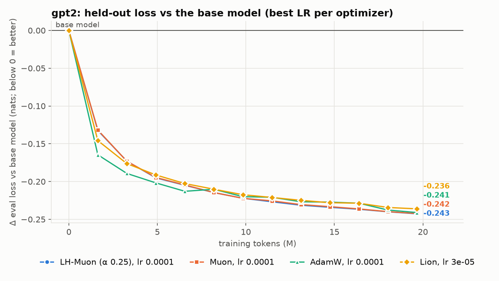

# gpt2: optimizers on continued pretraining

Continued pretraining on an equal mix of C4, Common Crawl, books, MegaWika and arXiv (Dolma v1.7), 600 steps × 32 × 1024 tokens = 19.7M tokens, WSD (warmup 30, linear decay over the last 20%), bf16 weights with stochastic rounding, all optimizers through LHMuon. Embeddings/head: factored Adam in every run. Base-model eval loss: **3.3075** (64 held-out windows).

| optimizer | LR | final eval | vs base | c4 | cc | books | wiki | arxiv | time | peak GiB |
|---|---|---|---|---|---|---|---|---|---|---|
| LH-Muon (α 0.25) | 0.0001 | **3.0649** | -0.2427 | -0.089 | -0.074 | -0.467 | -0.061 | -0.523 | 16 min | 10.5 |
| LH-Muon (α 0.25) | 0.0003 | 3.0878 | -0.2197 | -0.033 | -0.020 | -0.457 | -0.012 | -0.577 | 16 min | 10.5 |
| Muon | 0.0001 | **3.0652** | -0.2423 | -0.090 | -0.074 | -0.466 | -0.061 | -0.520 | 16 min | 10.5 |
| Muon | 0.0003 | 3.0831 | -0.2244 | -0.044 | -0.027 | -0.460 | -0.017 | -0.574 | 16 min | 10.5 |
| AdamW | 0.0001 | **3.0665** | -0.2410 | -0.086 | -0.074 | -0.465 | -0.059 | -0.521 | 15 min | 11.0 |
| AdamW | 0.0003 | 3.0938 | -0.2137 | -0.033 | -0.018 | -0.451 | -0.008 | -0.558 | 15 min | 11.0 |
| Lion | 1e-05 | 3.0792 | -0.2284 | -0.092 | -0.077 | -0.452 | -0.065 | -0.455 | 15 min | 10.7 |
| Lion | 3e-05 | **3.0714** | -0.2361 | -0.077 | -0.065 | -0.467 | -0.050 | -0.523 | 15 min | 10.7 |

Per-source columns are the change vs the base model on that source. 8 of 8 runs finished.

