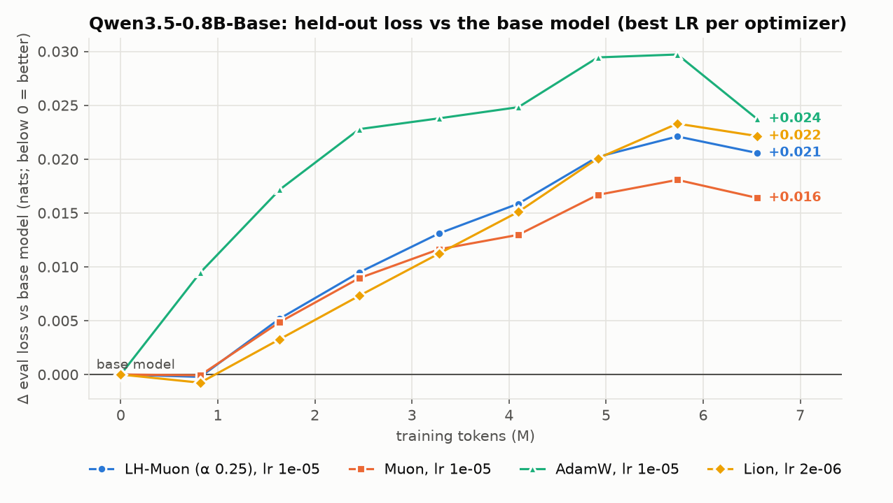

# Qwen3.5-0.8B-Base: optimizers on continued pretraining

Continued pretraining on an equal mix of C4, Common Crawl, books, MegaWika and arXiv (Dolma v1.7), 200 steps × 32 × 1024 tokens = 6.6M tokens, WSD (warmup 20, linear decay over the last 20%), bf16 weights with stochastic rounding, all optimizers through LHMuon. Embeddings/head: factored Adam in every run. Base-model eval loss: **2.6565** (64 held-out windows).

| optimizer | LR | final eval | vs base | c4 | cc | books | wiki | arxiv | time | peak GiB |
|---|---|---|---|---|---|---|---|---|---|---|
| LH-Muon (α 0.25) | 1e-05 | **2.6770** | +0.0206 | +0.028 | +0.029 | -0.015 | +0.029 | +0.033 | 52 min | 6.1 |
| Muon | 1e-05 | **2.6729** | +0.0164 | +0.023 | +0.023 | -0.016 | +0.025 | +0.027 | 52 min | 5.7 |
| AdamW | 1e-05 | **2.6802** | +0.0237 | +0.031 | +0.032 | -0.008 | +0.031 | +0.033 | 50 min | 8.9 |
| Lion | 2e-06 | **2.6786** | +0.0221 | +0.029 | +0.031 | -0.012 | +0.026 | +0.036 | 49 min | 7.0 |

Per-source columns are the change vs the base model on that source. 4 of 4 runs finished.

